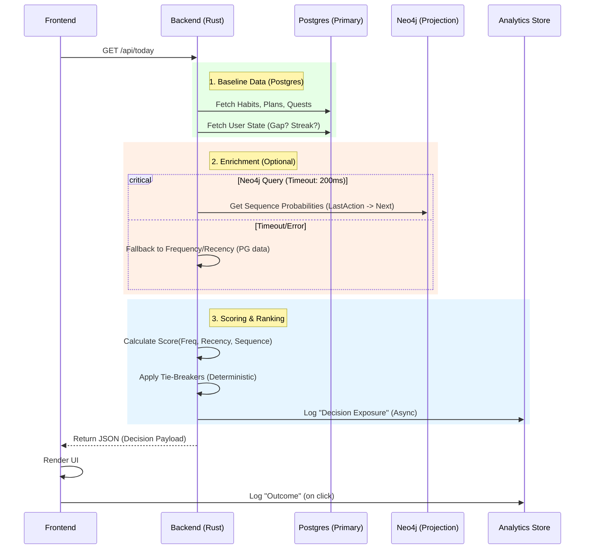

# Ignition OS — Master Feature Specification & Core Ideology + E2EE + Forward Requirements (Canonical)

**Date:** January 13, 2026  
**Status:** Active Development  
**Purpose:** Single source of truth for all features, gaps, improvements, architectural principles, and End-to-End Encryption (E2EE) requirements to ensure **only the user can decrypt their intellectual property** (admins/DB access cannot).

---

## Table of Contents

1. Core Ideology & Architectural Principles  
2. Complete Feature Inventory  
3. Implementation Status Matrix  
4. Known Gaps & Missing Implementations  
5. Proposed Enhancements  
6. Architectural Patterns & Constraints  
7. Data Persistence & Sync Rules  
8. Outstanding Issues & Blockers  
9. End-to-End Encryption (E2EE) — Option A (SSO + Multi-Device)  
10. Forward-Looking Items (Strategic) — Retained Verbatim  
11. Explicit Decisions — Resolved and Open  
12. Future State Specification: Starter Engine V2 (Dynamic UI & Decision Intelligence)  
13. Implementation Updates (January 2026)  

---

# 1. Core Ideology & Architectural Principles

## Philosophy

**Ignition OS** is a comprehensive productivity and music production assistant designed to:
- **Maximize focus** through intelligent task management and gamification
- **Enable creativity** with music production tools and learning systems
- **Preserve autonomy** through server-driven decisions that respect user choices
- **Minimize decision fatigue** by defaulting to reduced/simple modes
- **Build momentum** through cross-device sync and soft-landing transitions

## Fundamental Architecture

### 1. **Stateless Backend / Rendering-Only Frontend**

**Principle:** Backend handles ALL business logic; frontend only renders input/output.

```
User Input → Frontend (render) → Backend (process + decide) → Database → Result → Frontend (render)
```

**Correct Pattern:**
- ✅ Frontend delegates all decisions to backend
- ✅ API calls include `credentials: 'include'` for session cookies
- ✅ No client-side filtering, sorting, or state calculations
- ✅ Session data fetched per request, not cached in localStorage

**Anti-Pattern (❌ AVOID):**
- ❌ Frontend calculating business logic
- ❌ Storing business data in localStorage
- ❌ Client-side decision making
- ❌ Server-side auth checks in page components (causes redirect loops)

**E2EE Exception (Explicitly Allowed):**  
For user IP (Infobase/Ideas/Inbox/DAW/private work), the frontend **must** encrypt/decrypt client-side. This is a deliberate, documented exception to “render-only frontend,” and does **not** allow client-side business logic.

### 2. **Server-Driven Autonomy**

**Principle:** Server decides *what* to show; user decides *what to do*.

- Backend computes: content, priority, defaults, recommendations
- Frontend renders: exactly what backend sends, no modifications
- **No randomness** in server payloads - determinism required

### 3. **Reduced by Default**

**Principle:** Default to *less* content to prevent decision paralysis.

- After gaps (>3 days inactive): Reduced Mode (collapsed sections)
- After session completion: Soft Landing mode (single action focus)
- Progressive disclosure: Expand sections only when user has momentum

### 4. **Determinism & Consistency**

**Principle:** Same user state → Same dashboard layout every time.

- No random ordering or suggestions
- Reproducible decision payloads from backend
- Cross-device sync via Postgres (database is source of truth)

### 5. **Privacy-First Personalization**

**Principle:** Compute personalization from local data or anonymized aggregates only.

- No PII sent to external services
- Neo4j used for projection/analytics only
- User data never leaves the system boundary
- E2EE ensures admins/DB cannot read private work content

### 6. **Cross-Device Synchronization**

**Principle:** Session state + persistent data synchronized across all user devices.

- Postgres tables are source of truth
- Polling intervals per feature (30s for focus/planner, 1m for quests/habits)
- Session rotation on security-sensitive operations
- Cookie domain: `.ecent.online` (shared across subdomains)

### 7. **Responsive Yet Safe Sessions**

**Principle:** Fast authentication without sacrificing security.

- Sessions use HttpOnly cookies (XSS protection)
- SameSite=None required (cross-subdomain requests)
- Session rotation triggers: TOS acceptance, age verification, sensitive ops
- Short TTLs with implicit refresh on valid activity

---

# 2. Complete Feature Inventory

## Core Productivity Stack

### 1. **Today Dashboard** (`/today`)
**Status:** ✅ Fully Implemented  
**Purpose:** Central hub with personalized greeting and quick actions

**Features:**
- Time-based greeting (morning/afternoon/evening)
- Starter Block (single next action determined by server)
- Quick Picks (dynamic cards based on available tasks)
- Rewards section linking to Market
- Soft Landing mode after completing sessions

**Data Storage:**
- Postgres: Session data (daily_plans, focus_sessions, habits, quests)
- SessionStorage: Soft Landing state (transient, UI-only)

**APIs:**
- `GET /api/today` - Fetch dashboard payload with all sections

**Sync Contract:**
- Staleness window: 5 minutes
- User-initiated refresh only
- No auto-refresh (can add focus-based refetch)

---

### 2. **Focus Timer** (`/focus`)
**Status:** ✅ Fully Implemented  
**Purpose:** Pomodoro-style sessions with cross-device sync

**Features:**
- Configurable durations (focus/break/long break)
- Visual countdown timer with progress ring
- Mode switching with pause/resume
- Session history tracking
- Cross-device pause state sync
- Persistent focus indicator in bottom bar

**Data Storage:**
- Postgres: `focus_sessions`, `focus_pause_state`
- LocalStorage: Settings (durations, sound preferences)

**APIs:**
- `GET /api/focus` - List sessions
- `POST /api/focus` - Create session
- `GET /api/focus/active` - Get active session
- `POST /api/focus/[id]/complete` - Complete
- `POST /api/focus/[id]/abandon` - Abandon
- `GET/POST /api/focus/pause` - Pause state sync

**Sync Contract:**
- Cross-device: 30s polling to `/api/focus/active`
- Cross-tab: localStorage + Storage events
- Cannot pause when hidden (timer accuracy required)
- Polling deduplication between BottomBar and FocusIndicator

---

### 3. **Planner** (`/planner`)
**Status:** ✅ Fully Implemented  
**Purpose:** Calendar-based event management

**Features:**
- Month/week/day calendar views
- Event types: Meeting, Appointment, Workout, Other
- Color-coded events
- Recurring event support
- Create/edit/delete modals
- Link workouts from Exercise tab

**Data Storage:**
- Postgres: `calendar_events`

**APIs:**
- `GET /api/calendar` - List events (with date range filtering)
- `POST /api/calendar` - Create
- `PUT /api/calendar` - Update
- `DELETE /api/calendar` - Delete

**Sync Contract:**
- Cross-device: 30s polling
- Staleness window: 30 seconds
- Can pause when hidden
- Can reduce polling to 60s if no recent activity

---

### 4. **Quests** (`/quests`)
**Status:** ✅ Fully Implemented  
**Purpose:** Daily and weekly challenges with rewards

**Features:**
- Universal quests (admin-managed)
- Daily and weekly types
- Progress tracking per quest
- XP and coin rewards
- Skill association for XP distribution

**Data Storage:**
- Postgres: `universal_quests`, `user_quest_progress`

**APIs:**
- `GET /api/quests` - List with user progress
- `POST /api/quests` - Update progress, complete

**Sync Contract:**
- Cross-device: Fetch on mount
- Staleness window: 1 minute
- Can add focus-based refetch after >1m away
- Optimistic updates + POST pattern

---

### 5. **Goals** (`/goals`)
**Status:** ✅ Fully Implemented  
**Purpose:** Long-term goal tracking with milestones

**Features:**
- Create with title, description, category, deadline
- Categories: Health, Career, Personal, Creative, Financial
- Milestone sub-tasks
- Progress calculation from milestones
- Multi-device sync

**Data Storage:**
- Postgres: `goals`

**APIs:**
- `GET /api/goals` - List
- `POST /api/goals` - Create, update, delete, sync

**Sync Contract:**
- Optimistic updates + POST
- 1-minute staleness acceptable

---

### 6. **Exercise** (`/exercise`)
**Status:** ✅ Fully Implemented  
**Purpose:** Workout and exercise tracking with personal records

**Features:**
- Exercise library (built-in + custom)
- Workout templates
- Session logging with set tracking (weight, reps, RPE)
- Personal record (PR) tracking
- Link to planner events and quests

**Data Storage:**
- Postgres: `exercises`, `workouts`, `workout_sessions`, `exercise_sets`, `personal_records`

**APIs:**
- `GET /api/exercise` - List exercises, workouts, sessions, records, stats
- `POST /api/exercise` - Create
- `DELETE /api/exercise` - Delete
- `POST /api/exercise/seed` - Seed built-in exercises

---

### 7. **Progress** (`/progress`)
**Status:** ✅ Fully Implemented  
**Purpose:** Gamification dashboard with XP, levels, and skills

**Features:**
- Level and XP display
- Skill wheel visualization (Persona 5 style)
- Five skill categories: Knowledge, Guts, Proficiency, Kindness, Charm
- Coin balance display
- Recent activity feed
- Focus session statistics

**Data Storage:**
- Postgres: `user_progress`, `user_skills`

**APIs:**
- Backend syncs badges/pending habits to frontend via `/api/sync/poll`

**Sync Contract:**
- Fast loading via memory caches
- Multi-device sync via Postgres

---

### 8. **Market** (`/market`)
**Status:** ✅ Fully Implemented  
**Purpose:** Cosmetic shop and currency management

**Features:**
- Shop catalog (cosmetics, themes, etc.)
- Currency balance (XP, coins)
- Purchase mechanics
- User cosmetics management

**Data Storage:**
- Postgres: Market tables

**APIs:**
- `/api/market/*` endpoints

---

## Production Tools Stack

### 9. **Hub** (`/hub`)
**Status:** ✅ Fully Implemented  
**Purpose:** DAW shortcuts and quick navigation

**Features:**
- DAW-specific shortcuts (Ableton, FL Studio, Logic Pro)
- OS/view preference persistence
- Static DAW lists

**Data Storage:**
- Static JSON: `app/frontend/src/lib/data/shortcuts/*`
- Cookies: OS/view preferences

---

### 10. **Arrange** (`/arrange`)
**Status:** ✅ Fully Implemented  
**Purpose:** Music arrangement creation with Web Audio synthesis

**Features:**
- Lane creation and management
- Playback via Web Audio API
- Bar length and tempo features
- Arrangement persistence

**Data Storage:**
- LocalStorage: Arrangement state

---

### 11. **Templates** (`/templates`)
**Status:** ✅ Fully Implemented  
**Purpose:** Music production templates and patterns

**Features:**
- Chord progression templates
- Drum pattern templates
- Melody templates
- Genre-based organization

**Data Storage:**
- Static JSON data

---

### 12. **Reference Tracks** (`/reference`)
**Status:** ✅ Fully Implemented  
**Purpose:** Audio reference library for A/B comparison

**Features:**
- Local file library management
- Audio analysis (BPM, key detection)
- Waveform visualization
- Marker points for sections
- Analysis caching
- Optional passphrase encryption on upload for private references

**Data Storage:**
- Postgres: `track_analysis_cache`
- Browser: File references (IndexedDB/File System Access API)
- R2: Audio files (optionally client-encrypted)

---

### 13. **Hub / Shortcuts** (`/shortcuts`)
**Status:** ✅ Fully Implemented  
**Purpose:** Quick access to DAW workflows

**Features:**
- DAW-specific shortcuts
- Preference persistence

**Data Storage:**
- Static data + cookies

---

## Knowledge & Learning Suite

### 14. **Learn Dashboard** (`/learn`)
**Status:** ✅ Implemented  
**Purpose:** Central hub for learning features

**Features:**
- Overview + review count (✅)
- Continue item (✅)
- Weak areas (✅)
- Recent activity (✅)
- Review analytics snapshot (✅)

**Data Storage:**
- Postgres: Learning tables

**APIs:**
- `/api/learn/*` endpoints

---

### 15. **Courses** (`/learn/courses`)
**Status:** ✅ Implemented  
**Purpose:** Structured learning modules

**Features:**
- Course catalog: ✅ Live
- Lesson progression: ✅ Live
- Quiz assessments: ✅ Lesson quiz UI + scoring
- Progress tracking: ✅

**Data Storage:**
- Postgres: `learn_courses`, `learn_lessons`, `learn_progress`

**Notes:**
- Quiz/assessment UX remains a follow-up item

---

### 16. **Review** (`/learn/review`)
**Status:** ✅ Implemented  
**Purpose:** Spaced repetition flashcard system

**Features:**
- Flashcard review interface
- SM-2 algorithm for spacing
- Difficulty ratings
- Statistics tracking

**Data Storage:**
- Postgres: `learn_flashcards`, `learn_reviews`

**Notes:**
- Review analytics surfaced in Learn dashboard (retention, lapses, interval stats).

---

### 17. **Practice (Drills)** (`/learn/practice`)
**Status:** ✅ Implemented  
**Purpose:** Guided drills and practice sessions

**Features:**
- Drill list by topic
- Log session results (score, accuracy, time)
- Best score + streak tracking

**Data Storage:**
- Postgres: `learn_drills`, `user_drill_stats`

**APIs:**
- `GET /api/learn/topics/:id/drills` - List drills
- `POST /api/learn/drills/:id/submit` - Submit drill result

---

### 18. **Recipes** (`/learn/recipes`)
**Status:** ✅ Implemented  
**Purpose:** Production workflow recipes and techniques

**Features:**
- Step-by-step production guides
- Category organization
- Favorite/bookmark system
- Saved recipes persistence

**Data Storage:**
- Postgres: Recipe tables

---

### 19. **Glossary** (`/learn/glossary`)
**Status:** ✅ Implemented  
**Purpose:** Music production terminology dictionary

**Features:**
- Searchable term database
- Category filtering
- Cross-references

**Data Storage:**
- Static JSON data

---

### 20. **Journal** (`/learn/journal`)
**Status:** ✅ Implemented  
**Purpose:** Personal learning and production journal

**Features:**
- Daily entry creation
- Tag support
- Search and filter

**Data Storage:**
- Postgres: `learn_journal_entries` (content encrypted client-side)

---

### 21. **Infobase** (`/infobase`)
**Status:** ✅ Implemented  
**Purpose:** Personal knowledge base for notes and information

**Features:**
- Create, edit, delete entries
- Category organization
- Tag support
- Full-text search
- Markdown content

**Data Storage:**
- Postgres: `infobase_entries` (content encrypted client-side)
- LocalStorage fallback: `passion_infobase_v1` (deprecated when `DISABLE_MASS_LOCAL_PERSISTENCE` is true)

---

## System & Infrastructure

### 22. **Settings** (`/settings`)
**Status:** ✅ Fully Implemented  
**Purpose:** User preferences and app configuration

**Features:**
- Theme selection (Dark, Light, System)
- Notification preferences
- DAW preferences
- Account management

**Data Storage:**
- LocalStorage + Postgres: `user_settings`

---

### 23. **Admin Console** (`/admin`)
**Status:** ✅ Fully Implemented  
**Purpose:** Administrative interface for system management

**Access:** Restricted to admin emails

**Features:**
- User management
- Universal quest management
- Skill configuration
- Feedback review
- System statistics
- E2EE opaque-content banner (encrypted data cannot be inspected)

---

### 24. **Authentication**
**Status:** ✅ Fully Implemented  
**Purpose:** OAuth-based user authentication and authorization

**Features:**
- OAuth providers: Google, Microsoft (Azure AD)
- Age verification (16+ requirement)
- User approval workflow
- JWT sessions with Postgres adapter fallback
- Session rotation on sensitive operations

**Security:**
- ✅ HttpOnly cookies
- ✅ Cookie domain: `.ecent.online`
- ✅ SameSite=None
- ✅ Secure flag

---

### 25. **Command Palette** (`Cmd/Ctrl + K`)
**Status:** ✅ Fully Implemented  
**Purpose:** Global search and quick navigation

**Features:**
- Navigation commands
- Action commands
- Theme toggles
- Keyboard navigation
- Search filtering

---

### 26. **Mobile PWA** (`/m/*`)
**Status:** ✅ Fully Implemented  
**Purpose:** Mobile-optimized progressive web app

**Features:**
- Native-like mobile experience
- Bottom tab navigation
- Standalone mode support
- Safe area handling
- Offline-ready behavior via service worker

---

# 3. Implementation Status Matrix (Sorted by Priority & Completeness)

**Priority Tier:** Tier 1 = Core (required for MVP) | Tier 2 = Extended (expected) | Tier 3 = Advanced (nice-to-have)

| Feature | Tier | Priority | Desktop | Mobile | Status | DB Tables | API Endpoints | Cache Strategy |
|---------|------|----------|---------|--------|--------|-----------|---------------|-----------------|
| **Authentication** | 1 | ⭐⭐⭐ | ✅ | ✅ | Complete | sessions, users | `/api/auth/*` | SessionStorage |
| **Today Dashboard** | 1 | ⭐⭐⭐ | ✅ | ✅ | Complete | daily_plans, daily_plan_items | `/api/today` | Memory cache (5m) |
| **Focus Timer** | 1 | ⭐⭐⭐ | ✅ | ✅ | Complete | focus_sessions, focus_pause_state | `/api/focus/*` | Memory cache (30s) |
| **Planner** | 1 | ⭐⭐⭐ | ✅ | ✅ | Complete | calendar_events | `/api/calendar` | Memory cache (30s) |
| **Quests** | 1 | ⭐⭐⭐ | ✅ | ✅ | Complete | universal_quests, user_quest_progress | `/api/quests` | Memory cache (1m) |
| **Settings** | 1 | ⭐⭐⭐ | ✅ | ✅ | Complete | user_settings | `/api/settings` | LocalStorage + Postgres |
| **Progress/Gamification** | 2 | ⭐⭐⭐ | ✅ | ✅ | Complete | user_progress, user_skills | `/api/progress` | Memory cache (2m) |
| **Goals** | 2 | ⭐⭐ | ✅ | 🟡 | Complete | goals | `/api/goals` | Memory cache (1m) |
| **Exercise** | 2 | ⭐⭐ | ✅ | ✅ | Complete | exercises, workouts, workout_sessions | `/api/exercise` | Memory cache (1m) |
| **Market** | 2 | ⭐⭐ | ✅ | 🟡 | Complete | market tables | `/api/market/*` | Memory cache (5m) |
| **Hub (DAW Shortcuts)** | 2 | ⭐⭐ | ✅ | 🟡 | Complete | Static JSON | - | LocalStorage (preferences) |
| **Reference Tracks** | 2 | ⭐⭐ | ✅ | ❌ | Complete | track_analysis_cache | `/api/analysis` | Memory cache (1m) |
| **Learn Dashboard** | 2 | ⭐⭐ | ✅ | 🟡 | Complete | learn_* tables | `/api/learn` | Memory cache (2m) |
| **Review (Flashcards)** | 2 | ⭐⭐ | ✅ | 🟡 | Complete | learn_flashcards, learn_reviews | `/api/learn/review` | Memory cache (2m) |
| **Practice (Drills)** | 2 | ⭐ | ✅ | 🟡 | Complete | learn_drills, user_drill_stats | `/api/learn/topics/:id/drills`, `/api/learn/drills/:id/submit` | Memory cache (2m) |
| **Journal** | 2 | ⭐ | ✅ | ❌ | Complete | learn_journal_entries | `/api/learn/journal` | Memory cache (2m) |
| **Infobase** | 2 | ⭐ | ✅ | ❌ | Complete | infobase_entries | `/api/infobase` | Memory cache (1m) |
| **Recipes** | 3 | ⭐ | ✅ | ❌ | Complete | recipe tables | `/api/learn/recipes` | Memory cache (5m) |
| **Glossary** | 3 | ⭐ | ✅ | ❌ | Complete | Static JSON | - | Static + memory |
| **Templates** | 3 | ⭐ | ✅ | ❌ | Complete | Static JSON | - | Static + memory |
| **Arrange** | 3 | ⭐ | ✅ | ❌ | Complete | - | - | LocalStorage only |
| **Command Palette** | 3 | ⭐⭐ | ✅ | ❌ | Complete | - | - | Static + memory |
| **Admin Console** | 3 | ⭐ | ✅ | ❌ | Complete | admin tables | `/api/admin/*` | Memory cache (5m) |
| **Mobile PWA** | 2 | ⭐⭐ | ❌ | ✅ | Complete | All (mirrored) | All (mirrored) | Service Worker |
| **Courses (UI)** | 2 | ⭐ | ✅ | 🟡 | Complete (Desktop) | learn_courses, learn_lessons | `/api/learn/courses` | Memory cache (5m) |

---

# 4. Known Gaps & Missing Implementations

## Critical Gaps

### 1. E2EE Recovery Flows
- Recovery code lifecycle and vault reset UX not implemented
- Requires explicit SSO re-auth + confirmation flow

## Closed Gaps (January 2026)
- Review Analytics surfaced on Learn dashboard (retention, intervals, lapses).
- Offline UX visibility added with banner + queued mutation count.

---

# 5. Proposed Enhancements

## 1. DAW Project File Tracking & Versioning
- Upload/download with version history
- Metadata tracking: hash, size, modification time
- R2 versioning
- Client-side encryption, chunked uploads, resumability

## 1.1 DAW Folder Watcher Agent (Local)
- Local agent watches user-designated DAW project folders (e.g., `.als`, `.flp`, `.logicx`)
- Sends change events + metadata (hash/size/mtime) and can trigger encrypted uploads
- Explicit opt-in required; no silent background syncing
- Must respect E2EE posture and revocation rules if sharing is enabled

## 2. Telemetry & Analytics Framework
- Feature engagement
- Learning outcomes
- Production activity
- Privacy-first, no PII

## 3. Advanced Learning Features
- Weak area detection
- Learning path recommendations
- Review analytics dashboard (✅ shipped in Learn)

## 4. Habit System Completion (✅ Shipped)
- Daily habit log UI ✅
- Streak tracking ✅
- Habit analytics ✅ (`/api/habits/analytics` + dashboard)

---

# 6. Architectural Patterns & Constraints

## Stateless Backend / Frontend Rendering Pattern
- Backend owns business logic
- Frontend renders only
- No client-side sorting/filtering for business logic

## Auth & Sessions
- cookies: HttpOnly, Secure, SameSite=None
- domain: `.ecent.online`
- `credentials: 'include'`

## Schema Discipline
- migrations only
- test fresh migrate from 0001 → head

## Frontend Sync Contracts

| Feature | Polling Interval | Can Pause When Hidden | Staleness Window |
|---------|------------------|----------------------|------------------|
| Focus | 30s | ❌ No | 30s |
| Planner | 30s | ✅ Yes | 30s |
| Quests | On mount | ✅ Yes | 1m |
| Habits | On mount | ✅ Yes | 1m |
| Today | User-initiated | N/A | 5m |

---

# 7. Data Persistence & Sync Rules

## 7.1 Persistence Matrix (Sorted by Priority & Staleness Window)

| Feature | Postgres Database | LocalStorage | SessionStorage | R2 Storage | Sync Pattern | Staleness Window | Quick Load Source |
|---------|-------------|--------------|--------|-----------|----------------|------------------|-------------------|
| Soft Landing | - | - | ✅ Primary | - | UI-only (TTL) | Session-bound | SessionStorage |
| Focus Sessions | ✅ Primary | Settings ⚙️ | - | - | 30s poll | 30s | Memory cache |
| Focus Pause State | ✅ Primary | - | - | - | Cross-device sync | 10s | Memory cache |
| Planner Events | ✅ Primary | - | - | - | 30s poll | 30s | Memory cache |
| Theme Preference | ✅ Primary | ✅ Read-through | - | - | On change + async | 1m | LocalStorage |
| User Settings | ✅ Primary | ✅ Read-through | - | - | On change + async | 5m | LocalStorage |
| Quests | ✅ Primary | - | - | - | Mount + optimistic | 1m | SyncState cache |
| Habits | ✅ Primary | - | - | - | Mount + optimistic | 1m | SyncState cache |
| Goals | ✅ Primary | - | - | - | Mount + optimistic | 1m | SyncState cache |
| Exercise | ✅ Primary | - | - | - | Mount + optimistic | 1m | SyncState cache |
| Progress/XP | ✅ Primary | - | - | - | Sync endpoint | 2m | Memory cache |
| Market | ✅ Primary | - | - | - | On demand | 5m | Memory cache |
| Player State | ✅ Primary | ✅ Persistence | IndexedDB | - | Periodic + on change | 5m | LocalStorage |
| Player Queue | ✅ Primary | ✅ Cosmetic only | - | - | On change | N/A | LocalStorage |
| Reference Tracks | ✅ Metadata | - | - | ✅ Primary | On upload/download | Permanent | Memory cache |
| DAW Shortcuts | Static | ✅ Preferences | - | - | On change | N/A | LocalStorage |
| DAW Projects | ✅ Metadata | - | - | ✅ Primary | Versioned + chunked | Permanent | R2 + metadata |
| Infobase | ✅ Primary | ⚠️ Deprecated fallback (`passion_infobase_v1`) | - | - | On save + periodic | 1m | SyncState cache |
| Audio Analysis | ✅ Cache | - | - | - | On reference add | 1m | Memory cache |
| Learning Cards | ✅ Primary | - | - | - | On mount + optimistic | 2m | SyncState cache |
| Journal Entries | ✅ Primary | - | - | - | On save | 2m | SyncState cache |
| Recipes | ✅ Primary | - | - | - | On mount | 5m | Memory cache |
| Glossary | Static | - | - | - | N/A | N/A | Static JSON |
| Templates | Static | - | - | - | N/A | N/A | Static JSON |
| Command Palette Index | Static | 🔄 Optional cache | - | - | N/A | N/A | Static + memory |
| Approval Status | ✅ Primary | - | - | - | On mount | 5m | Memory cache |

---

## 7.2 Quick Loading Strategy (Retained State & Connectivity Patterns)

### 7.2.1 Three-Tier Fast Loading Architecture

All client pages implement **three-tier rendering** for fast UX without compromising data consistency:

```
Tier 1 (Instant)    → Load from cache (memory, localStorage, sessionStorage)
    ↓ (50-100ms)
Tier 2 (Fast)       → Parallel fetch from API + show stale data if available
    ↓ (50-300ms)
Tier 3 (Fresh)      → Replace with fresh data when API responds
    ↓ (200-500ms)
Tier 4 (Validation) → Background staleness check; refetch if >window
```

**Pattern:** "Skeleton → Stale → Fresh" maintains perceived responsiveness.

### 7.2.2 Retained State by Storage Layer

#### LocalStorage (Persistent, Cross-Tab)
**Purpose:** User preferences and non-critical UI state that survives browser restart.

**Current Implementations:**
```
# Active (cosmetic or local-only)
passion_os_theme_prefs_v1          → Theme ID (dark/light/system)
theme                              → Legacy theme string (deprecated)
passion-os-theme                   → Legacy theme fallback (deprecated)
passion_player_v1                  → Player settings (volume, playback speed)
passion_player_queue_v1            → Player queue snapshot
omnibar_command_history_v1         → Command palette history
passion_command_metrics_v1         → Omnibar metrics
passion_arrangements_v1            → Arrange data (local-only)
passion_waveform_cache_v1          → Waveform cache (local-only)

# Deprecated fallbacks (gated by DISABLE_MASS_LOCAL_PERSISTENCE)
focus_settings                     → Focus settings (deprecated)
focus_paused_state                 → Focus pause fallback (deprecated)
passion_goals_v1                   → Goals cache fallback (deprecated)
passion_quest_progress_v1          → Quest progress fallback (deprecated)
passion_infobase_v1                → Infobase cache fallback (deprecated)
passion_learn_settings_v1          → Learn settings fallback (deprecated)
music_ideas                        → Ideas cache fallback (deprecated)
passion_analysis_cache_v1          → Audio analysis cache (deprecated)
```

**Write Pattern:**
- Write on user action (debounced 500ms for high-frequency updates)
- Use `safeSetItem()` wrapper for incognito/CSP compatibility
- No business logic data (only UI cosmetics)

**Read Pattern:**
- On mount: `safeGetItem(key)` (graceful null if unavailable)
- On window focus: optionally refetch from Postgres if stale
- During offline: read-only access (assume could be stale)

---

#### SessionStorage (Transient, Single-Tab, Fast)
**Purpose:** UI-only state that should not persist across tabs or browser restarts.

**Current Implementations:**
```
passion_soft_landing_v1            → Today page Soft Landing state (TTL: session)
passion_soft_landing_source        → Soft Landing trigger source (TTL: session)
passion_momentum_v1                → Momentum feedback shown/dismissed (TTL: session)
today_reduced_mode_dismissed       → Reduced Mode dismissal flag (TTL: session)
passion_refresh_<feature>          → Last fetch timestamp per feature (auto-refresh)
```

**Write Pattern:**
- Write immediately on UI interaction (no debounce needed)
- Should NOT survive navigation or tab close
- Clear on logout

**Read Pattern:**
- On component mount: check for session state
- If exists and not stale (< session TTL): use it
- Otherwise: compute from API or use default

---

#### Memory Cache (In-Process, Fast)
**Purpose:** Feature-specific caches that reset on page reload but are fast between renders.

**Pattern (SyncStateContext):**
```typescript
// In Memory
{
  focus: { 
    active: FocusSession | null,
    lastFetch: timestamp,
    staleness: 30s
  },
  quests: {
    items: Quest[],
    lastFetch: timestamp,
    staleness: 1m
  },
  // ...per feature
}
```

**Implementations:**
- `SyncStateContext` (React Context) for cross-component sharing
- Auto-refresh per feature's staleness window
- Cleared on page/tab close

**Read Pattern:**
```typescript
const cached = useSyncState('quests');
if (cached && !isStale(cached)) {
  return cached;  // Instant load
} else {
  return apiFetch();  // Start fetch, show skeleton
}
```

---

#### IndexedDB (Persistent, Large Storage)
**Purpose:** Larger data structures (audio analysis cache, offline queue).

**Current Implementations:**
```
ignition-offline/mutations         → Pending offline mutations (PWA queue)
passion_os_audio/audio_files       → Stored audio files for Reference Tracks
```

**Pattern:**
```typescript
const db = new IDBDatabase('ignition_os');
await db.put('audio_cache', trackHash, { waveform, bpm, key });
const result = await db.get('audio_cache', trackHash);
```

**Expiry Strategy:** Use object `{ data, expiresAt }` with cleanup on read.

---

#### Postgres (Source of Truth)
**Purpose:** Authoritative, multi-device, durable storage.

**Read Pattern (from frontend):**
1. Check memory cache → return if not stale
2. Check localStorage/sessionStorage → show if available (mark stale)
3. Fetch from API → update all caches on arrival
4. Always prefer API response over stale local data

**Async Background Refresh:**
```typescript
useEffect(() => {
  const staleness = 60000; // 1 minute
  const timer = setInterval(() => {
    if (Date.now() - lastFetch > staleness) {
      apiRefresh(); // Don't block UI
    }
  }, staleness);
  return () => clearInterval(timer);
}, [lastFetch]);
```

---

### 7.2.3 Connectivity & Fallback Strategies

#### Scenario 1: Online, Fresh Data Available
```
Flow: API fetch → Complete in <300ms → Render fresh → Update all caches
```

#### Scenario 2: Online, Stale Cache Available
```
Flow: Render skeleton → Show stale from memory/localStorage → 
      Fetch in background → Replace with fresh → Update caches
```

#### Scenario 3: Online, No Cache (First Visit)
```
Flow: Show skeleton/placeholder → Fetch from API → Render → Cache
```

#### Scenario 4: Offline, Cache Available
```
Flow: Show from localStorage/IndexedDB → Queue mutations (optimistic) → 
      On reconnect: replay mutations → Refetch to reconcile
```

#### Scenario 5: Offline, No Cache
```
Flow: Show empty state with reconnect message → Retain user input (form state) → 
      Auto-sync on reconnect
```

---

### 7.2.4 Validation & Consistency Rules

#### Rule 1: Postgres is Always Right
- If API returns data newer than cache, cache loses.
- LocalStorage writes must be read-through verified within 5 minutes.
- Cross-device sync: Postgres poll always overwrites local optimistic updates if conflict.

#### Rule 2: Staleness Tolerance
```
User Preference Data (Theme, Settings)     → 5 minute tolerance
Session/Focus Data                          → 10-30 second tolerance  
Quest/Habit Progress                        → 1-2 minute tolerance
User-Facing Cosmetics (Player Queue)        → 5 minute tolerance
```

#### Rule 3: Cache Invalidation
```
On explicit user action: Invalidate immediately
On background refresh: Stagger by feature to avoid thundering herd
On logout: Clear all localStorage, memory caches, and IndexedDB
On session rotation: Invalidate memory caches (force re-fetch)
```

#### Rule 4: Optimistic Updates
```
Safe for:  Settings, Theme, Cosmetics, UI state (SessionStorage)
Unsafe for: Business logic (Quests, Goals, Focus) - use POST patterns instead
```

---

### 7.2.5 Proposed Enhancement Patterns (Future)

#### Pattern A: Service Worker Cache-First (PWA Offline)
```typescript
// In service worker
self.addEventListener('fetch', (event) => {
  if (event.request.method === 'GET') {
    event.respondWith(
      caches.match(event.request)
        .then(cached => cached || fetch(event.request))
    );
  }
});
```
**Benefit:** Offline read access to reference endpoints  
**Cost:** Stale data management, cache invalidation complexity

---

#### Pattern B: Delta Sync (Only Changes)
```typescript
// Backend enhancement
GET /api/sync/poll?since=<timestamp>
  → Returns only rows modified since timestamp
  → Frontend merges into local state
```
**Benefit:** Reduced bandwidth (100x less for large datasets)  
**Cost:** Merge logic complexity, requires MVCC or audit log

---

#### Pattern C: Web Locks API (Cross-Tab Sync)
```typescript
// Ensure only one tab writes at a time
const lock = await navigator.locks.request('db-write', async () => {
  // Safe to write to localStorage
  safeSetItem(key, value);
});
```
**Benefit:** Prevent race conditions in multi-tab scenarios  
**Cost:** Browser support (modern browsers only)

---

#### Pattern D: Partial Hydration (Next.js 16)
```typescript
// Server-side: embed critical data in HTML
<script id="__NEXT_DATA__">
  { "initialState": { quests, habits, focus } }
</script>

// Client-side: parse and populate cache on hydration
const initialState = JSON.parse(document.getElementById('__NEXT_DATA__').textContent);
setMemoryCache(initialState);
```
**Benefit:** Zero network latency for first paint  
**Cost:** Larger HTML bundle, complexity in SSR

---

#### Pattern E: IndexedDB Blob Sync (Large Data)
```typescript
// Backend: provide blob checksums
GET /api/quests?include_hash=true
  → { items: [...], hash: "sha256abc123" }

// Frontend: validate IndexedDB against checksum
const cached = await idb.get('quests');
if (cached?.hash !== apiHash) {
  await idb.put('quests', freshData);
}
```
**Benefit:** Skip network for large stable datasets (glossaries, templates)  
**Cost:** Checksum computation, IDB complexity

---

#### 7.2.6 Current LocalStorage Keys (Fact-Checked Inventory from Codebase)

**Namespace Convention:** `passion_os_<feature>_v<version>` or `<feature>_<subfeature>`

| Key | Feature | Type | Component | Scope | Size | Backend Sync | Notes |
|-----|---------|------|-----------|-------|------|--------------|-------|
| `passion_os_theme_prefs_v1` | Theme | String (theme ID) | ThemeProvider | Cross-tab | <100B | Yes (async) | ✅ Using safe wrappers |
| `theme` | Theme | String (dark/light) | CommandPalette | Cross-tab | <20B | Deprecated | ⚠️ Legacy theme toggle |
| `passion-os-theme` | Theme | String | theme/script.ts | Cross-tab | <20B | No | ⚠️ Legacy fallback |
| `focus_settings` | Focus | JSON | FocusClient.tsx | Cross-tab | ~500B | No | Deprecated when `DISABLE_MASS_LOCAL_PERSISTENCE` |
| `focus_paused_state` | Focus | JSON | FocusClient.tsx | Cross-tab | ~100B | No | Deprecated fallback |
| `passion_player_v1` | Audio Player | JSON | player/persist.ts | Cross-tab | ~500B | No | Player settings (volume, speed) |
| `passion_player_queue_v1` | Player Queue | JSON | player/persist.ts | Cross-tab | Variable | No | Queue snapshot (cosmetic) |
| `passion_waveform_cache_v1` | Waveform Cache | JSON | player/waveform.ts | Cross-tab | ~50KB | No | Local-only waveform cache |
| `passion_analysis_cache_v1` | Audio Analysis | JSON | player/analysis-cache.ts | Cross-tab | ~50KB | No | Deprecated when `DISABLE_MASS_LOCAL_PERSISTENCE` |
| `omnibar_command_history_v1` | Command Palette | JSON | command-palette/behavioral-intelligence.ts | Cross-tab | ~5KB | No | Recent commands |
| `passion_command_metrics_v1` | Command Metrics | JSON | OmnibarEnhanced.tsx | Cross-tab | ~2KB | No | Command usage metrics |
| `passion_goals_v1` | Goals | JSON | GoalsClient.tsx | Cross-tab | Variable | No | Deprecated fallback |
| `passion_quest_progress_v1` | Quests | JSON | QuestsClient.tsx | Cross-tab | Variable | No | Deprecated fallback |
| `passion_infobase_v1` | Infobase | JSON | InfobaseClient.tsx | Cross-tab | Variable | No | Deprecated fallback |
| `passion_learn_settings_v1` | Learn Settings | JSON | learn/settings/page.tsx | Cross-tab | ~1KB | No | Deprecated fallback |
| `music_ideas` | Ideas | JSON | IdeasClient.tsx | Cross-tab | Variable | No | Deprecated fallback |
| `passion_arrangements_v1` | Arrange Tool | JSON | ArrangeClient.tsx | Cross-tab | Variable | No | Local-only arrangement data |

**SessionStorage Keys (Cleared on Tab Close):**

| Key | Feature | Type | Component | Scope | TTL | Content | Notes |
|-----|---------|------|-----------|-------|-----|---------|-------|
| `passion_soft_landing_v1` | Today Page | String | lib/today/softLanding.ts | Single-tab | Session | Soft landing state | Transient UI state |
| `passion_soft_landing_source` | Today Page | String | lib/today/softLanding.ts | Single-tab | Session | Soft landing source | Diagnostics |
| `passion_momentum_v1` | Momentum | String | lib/today/momentum.ts | Single-tab | Session | Feedback shown/dismissed | Transient UI state |
| `today_reduced_mode_dismissed` | Reduced Mode | String | ReducedModeBanner.tsx | Single-tab | Session | Dismiss flag | Prevents re-show |
| `passion_refresh_<feature>` | Auto-refresh | String | useAutoRefresh.ts | Single-tab | Session | Last fetch timestamp | Prefix-based keys |

**Safe Wrapper Implementation:**
```typescript
// lib/storage-safe.ts
export function canAccessStorage(): boolean {
  // Test localStorage availability once per session
  try {
    const test = '__test';
    localStorage.setItem(test, test);
    localStorage.removeItem(test);
    return true;
  } catch {
    return false; // Incognito/CSP-restricted context
  }
}

export function safeGetItem(key: string): string | null {
  if (!canAccessStorage()) return null;
  try {
    return localStorage.getItem(key);
  } catch {
    return null;
  }
}

export function safeSetItem(key: string, value: string): boolean {
  if (!canAccessStorage()) return false;
  try {
    localStorage.setItem(key, value);
    return true;
  } catch {
    return false;
  }
}
```

---

### 7.2.7 Connectivity & Offline Support Strategy

#### Current State (Live)

**Online Connectivity:**
- ✅ Direct API calls via `fetch()` with `credentials: 'include'`
- ✅ Session cookie persistence across requests
- ✅ Parallel requests (no queue)
- ✅ Error recovery: 401 → signOut, 5xx → retry with exponential backoff

**Offline Support:**
- ✅ Service worker caches GET `/api/*` (network-first with cache fallback)
- ✅ IndexedDB offline mutation queue with replay on reconnect
- ✅ Uses `navigator.locks` to serialize API mutations + offline replay
- ✅ Offline queue blocks E2EE writes when offline (no queued ciphertext)
- ✅ Offline banner + queued mutation count visible in UI

**Cross-Device Sync:**
- ✅ Postgres polling (30s for focus/planner, 1-2m for quests/habits)
- ✅ Session cookie shared via domain `.ecent.online`
- ❌ No real-time push (Websocket/SSE not implemented)
- ❌ No conflict resolution for simultaneous edits

**Multi-Tab Sync:**
- ✅ LocalStorage changes sync via Storage events
- ✅ SessionStorage isolated per tab (intentional)
- ⚠️ Race conditions possible if multiple tabs write simultaneously
- 🟡 Web Locks used for offline queue replay only; no general write coordination

---

#### Proposed Enhancement Patterns (Prioritized)

**Priority 1: Offline Read (High Impact)**
Status: ✅ Implemented (`/public/sw.js` caches GET `/api/*` with network-first + cache fallback)
```typescript
// Pattern: Service Worker Network-First (cache fallback)
// Benefit: Fast repeat visits, graceful offline read
// Cost: Cache invalidation complexity

// 1. Register service worker on app mount
if ('serviceWorker' in navigator) {
  navigator.serviceWorker.register('/sw.js');
}

// 2. Service worker caches GET requests
self.addEventListener('fetch', (event) => {
  if (event.request.method === 'GET') {
    event.respondWith(
      caches.open('api-cache-v1').then(cache => {
        return fetch(event.request)
          .then(response => {
            cache.put(event.request, response.clone());
            return response;
          })
          .catch(() => cache.match(event.request));
      })
    );
  }
});

// 3. Frontend: Show offline indicator when no network
const [isOnline, setIsOnline] = useState(navigator.onLine);
window.addEventListener('online', () => setIsOnline(true));
window.addEventListener('offline', () => setIsOnline(false));
```

**Priority 2: Multi-Tab Sync with Web Locks (Medium Impact)**
```typescript
// Pattern: Prevent write race conditions
// Benefit: Guarantees consistency when same user opens multiple tabs
// Cost: Adds latency to writes (lock acquisition)

// Implementation
const acquireLock = async () => {
  const lock = await navigator.locks.request('ignition-db-write', async () => {
    // Safe to write to localStorage
    safeSetItem(key, value);
    // Safe to POST to API (won't conflict with other tab)
    await apiPost(endpoint, data);
  });
};
```

**Priority 3: Delta Sync (Backend Enhancement - Medium Cost)**
```typescript
// Pattern: Only fetch changed records since last sync
// Benefit: 100x bandwidth reduction for large datasets
// Cost: Backend timestamp tracking + merge logic on client

// Backend API (new endpoint)
GET /api/sync/delta?since=<timestamp>
  → Returns only rows modified after timestamp
  → Includes deleted IDs

// Frontend implementation
const lastSync = localStorage.getItem('last_sync_quests');
const changes = await apiGet('/api/sync/delta?since=' + lastSync);
// Merge changes into memory cache
syncState.quests = mergeChanges(syncState.quests, changes);
```

**Priority 4: Offline Queue with Sync (High Complexity)**
Status: ✅ Implemented for non-E2EE writes (IndexedDB queue + replay on `online`)
```typescript
// Pattern: Queue mutations when offline, replay on reconnect
// Benefit: Seamless offline experience (write + sync later)
// Cost: Conflict resolution, deduplication, retry logic

// 1. IndexedDB queue
const queueMutation = async (mutation) => {
  const db = new IDBDatabase('ignition-queue');
  await db.put('mutations', mutation, mutation.id);
};

// 2. On reconnect
window.addEventListener('online', async () => {
  const db = new IDBDatabase('ignition-queue');
  const mutations = await db.getAll('mutations');
  
  for (const mutation of mutations) {
    try {
      const response = await apiPost(mutation.endpoint, mutation.data);
      await db.delete('mutations', mutation.id);
    } catch (error) {
      // Retry logic
      mutation.retries = (mutation.retries || 0) + 1;
      if (mutation.retries > 3) {
        // Show error to user
        showNotification('Failed to sync: ' + mutation.endpoint);
      } else {
        await queueMutation(mutation);
      }
    }
  }
});
```

**Priority 5: Real-Time Push (WebSocket - Future, High Cost)**
```typescript
// Pattern: Server pushes updates instead of client polling
// Benefit: Instant multi-device sync (no 30s delay)
// Cost: Server complexity, connection management, battery impact on mobile

// If implemented (future):
const ws = new WebSocket('wss://api.ecent.online/api/ws');
ws.addEventListener('message', (event) => {
  const { type, data } = JSON.parse(event.data);
  if (type === 'focus_session_updated') {
    syncState.focus = data;
  }
});
```

---

#### Current Implementation Gaps (Blocking PWA Full Offline)

| Gap | Impact | Complexity | Timeline |
|-----|--------|-----------|----------|
| No Delta Sync | Bandwidth inefficient | 2 days | v2.0 |
| No Real-Time Push | 30s sync delay | 2 weeks | v2.1 |
| Legacy localStorage Keys | Technical debt | 1 day | v1.1 |

---

### 7.2.8 Recommended Implementation Order (No Loss of Existing Data)

1. **Cleanup Phase (0.5 days):**
   - Deprecate `theme` and `passion-os-theme` keys
   - Migrate to `passion_os_theme_prefs_v1`
   - Keep fallback reads for 2 versions (backwards compat)
   - **All existing data preserved in new key**

2. **Safe Wrapper Expansion (1 day):**
   - ✅ `storage-safe.ts` shipped
   - ⚠️ Remaining direct localStorage calls still exist
   - Test in incognito mode

3. **Service Worker (1 day):**
   - ✅ `/public/sw.js` shipped
   - ✅ Caches GET `/api/*` responses
   - ✅ Offline indicator UI + queue count banner

4. **Web Locks (1 day):**
   - ✅ Applied to API mutations (client lock `api-mutation`)
   - ⚠️ Not yet applied to direct localStorage writes

5. **IndexedDB Migration (2 days):**
   - Migrate audio cache from localStorage to IndexedDB
   - Add expiry logic (TTL on each entry)
   - Transparent migration (read old → write new)

6. **Delta Sync (2 days, Backend):**
   - Add `updated_at` timestamp to all mutable tables
   - New endpoint: `GET /api/sync/delta?table=quests&since=<timestamp>`
   - Frontend merge logic

**Total Effort:** 8 days  
**Breaking Changes:** None (all backwards compatible)  
**Data Loss Risk:** Zero (migration strategy preserves all data)

---


---

# 8. Outstanding Issues & Blockers

## Critical Blockers

### 1. Database Schema Mismatch
- missing tables and columns
- migrations behind app code

### 2. Server-Side Auth Redirect Loops
- server components performing auth checks
- middleware must own auth gating

---

# 9. End-to-End Encryption (E2EE) — Option A (SSO + Multi-Device)

## Goal
Encrypt user intellectual property so **only the user can decrypt**; server stores opaque blobs.

## Key Points
- Works with Google/Microsoft SSO
- Supports multiple devices
- Requires user-held vault secret (passphrase) separate from SSO

## Architecture

User Vault Passphrase
  → derive key (PBKDF2-HMAC-SHA256, 100k iterations, 16-byte salt)
  → encrypt/decrypt private work (AES-256-GCM, 12-byte IV)

**Note:** v1 ships without KEK wrapping or Argon2id; those remain planned for v2.

## Vault Operations
- Init vault (first-time)
- Unlock vault (per session/device)
- Rewrap KEK (passphrase change) — v2
- Recovery codes (one-time) — v2

## Record Rules
- One encrypted blob per record
- IV 12 bytes, salt 16 bytes
- Payload format: `{ iv, salt, cipher, version }`
- AAD not used in v1 (future: bind user_id + record_id + type + version)

## DAW Files
- Chunked client encryption
- R2 stores ciphertext
- Postgres stores metadata pointers

---

# 10. Forward-Looking Items (Strategic) — Retained Verbatim

Below are **forward-looking items that are important but not yet explicitly captured**, given Ignition OS’s scale, E2EE posture, SSO-only auth, and server-driven ideology. This is intentionally strategic, not feature creep.

---

## 1. Cryptographic & Trust Lifecycle (Very Important)

### 1.1 Crypto Versioning as a First-Class Concept

You already have `encryption_version`, but going forward you need:

* **Algorithm agility** (ability to migrate without breaking users)
* **Key format versioning** (KEK v1, wrapped format v2, etc.)
* **AAD schema versioning**

Action:

* Define a `CryptoPolicy` doc:

  * current algorithms
  * deprecated versions
  * migration triggers
* Add `crypto_policy_version` to vault metadata.

Why it matters:

* E2EE systems rot if they can’t evolve safely.

---

### 1.2 Explicit Trust Boundaries in Code

Right now trust is conceptual. Make it enforceable.

Action:

* Mark modules as:

  * `server_trusted`
  * `client_private`
  * `e2ee_boundary`
* Enforce via linting or code review checklist.

Example:

* `/api/today` → server_trusted
* `VaultService` → client_private
* `InfobaseClient` → e2ee_boundary

Why:

* Prevent accidental plaintext handling in future features.

---

## 2. Search, Indexing & UX under E2EE (Critical UX Risk)

### 2.1 Client-Side Search Infrastructure

Once infobase/ideas are encrypted:

* Server-side full-text search dies.
* Naive client filtering will not scale.

Action:

* Plan a **client-side encrypted search index**:

  * build index in memory or IndexedDB
  * regenerate on unlock
  * discard on lock/logout

Optional v2:

* Deterministic encrypted tokens (careful: leakage tradeoffs).

Why:

* Without this, encrypted infobase becomes frustrating at scale.

---

### 2.2 Encrypted Data & Server-Driven Decisions Tension

Your ideology says:

> server decides what to show

But encrypted content means:

* server cannot inspect text to decide relevance.

Action:

* Formalize a rule:

  * Server decisions may only use **non-content signals**

    * timestamps
    * counts
    * completion flags
    * explicit user-set metadata

This avoids accidental backsliding into plaintext requirements.

---

## 3. UX Clarity Around “Privacy Modes” (High Impact)

### 3.1 Make Privacy an Explicit Mode, Not an Implementation Detail

Users should understand:

* what is protected
* what is not
* what happens if they lose access

Action:

* Introduce a visible concept:

  * “Private Work (Encrypted)”
  * “Standard Work”

Tie to:

* Infobase entries
* Ideas
* Journal
* DAW projects

Why:

* Reduces support issues and legal ambiguity.

---

### 3.2 Recovery Friction Is a Feature, Not a Bug

You should intentionally slow recovery actions.

Action:

* Add friction to:

  * recovery code use
  * vault reset
* Require:

  * explicit warnings
  * re-authentication via SSO
  * confirmation screens

Why:

* Prevent social engineering and accidental data loss.

---

## 4. Offline, PWA, and Long-Running Sessions (Often Missed)

### 4.1 Offline + E2EE Reality Check

Mobile PWA + offline implies:

* encrypted data cached locally
* KEK may need to persist across refreshes (dangerous)

Action:

* Decide explicitly:

  * **Offline read allowed?** (after unlock)
  * **Offline write allowed?** (queued ciphertext)
* Define:

  * max offline duration
  * auto-lock behavior

Why:

* Implicit behavior here can silently break security guarantees.

---

### 4.2 Session + Vault Locking Policy

Define clearly:

* When does the vault auto-lock?

  * tab close
  * inactivity timer
  * device sleep
  * mobile backgrounding

Action:

* Write a “Vault Lock Policy”:

  * desktop vs mobile
  * focus timer running vs idle
  * soft landing interactions

---

## 5. Admin, Support, and Legal Reality (Non-Technical but Critical)

### 5.1 Admin UX for “We Cannot See This”

Admin console must reflect E2EE reality.

Action:

* In admin views:

  * show encrypted records as opaque
  * display banner: “Content encrypted; not accessible”
* Prevent admin tools from assuming plaintext.

Why:

* Avoid accidental claims that support can inspect user content.

---

### 5.2 Legal & Compliance Positioning

If you claim:

> admins cannot read user data

Then:

* your privacy policy must reflect that
* your data processing agreements must be aligned
* support workflows must avoid promising recovery

Action:

* Add an internal “E2EE Claims Checklist”:

  * what you guarantee
  * what you explicitly do not guarantee

---

## 6. DAW & Large File Future (High Cost Area)

### 6.1 Chunked Encryption as a First-Class Primitive

DAW files will force you here.

Action:

* Standardize:

  * chunk size
  * per-chunk nonce strategy
  * resumable upload metadata format
* Reuse the same system for:

  * reference audio
  * future video/assets

Why:

* Retrofitting chunking later is painful.

---

### 6.2 Deterministic File Identity vs Privacy

You already mention SHA-256 hashes.

Decision to make:

* Are hashes computed on:

  * plaintext (better dedup, leaks info)
  * ciphertext (worse dedup, better privacy)

Recommendation:

* Use **ciphertext hashes** for v1.
* Accept dedup loss.

---

## 7. Observability Without Privacy Regression

### 7.1 Telemetry Red Lines

Before telemetry expands:

Define:

* What fields are **never logged**:

  * ciphertext
  * sizes above thresholds?
  * timing that could leak behavior?

Action:

* Add automated log scanning in CI for forbidden fields.

---

### 7.2 Decision Outcome Telemetry (Safe & Valuable)

You already hinted at:

> decision exposure → outcome telemetry

This is safe if:

* payload IDs are logged, not content
* outcomes are boolean/categorical

This is a **big future value lever** without privacy cost.

---

## 8. Future-Proofing the Ideology Itself

### 8.1 Document “Allowed Exceptions” Explicitly

You already made one (E2EE).

Action:

* Maintain a short list:

  * E2EE crypto on client
  * UI-only sessionStorage
  * local settings persistence

Why:

* Prevent ideology drift and future arguments.

---

### 8.2 Decide Early: Will Ignition OS Ever Be Collaborative?

Collaboration + E2EE is a *different problem class*.

Action:

* Add a non-goal statement:

  * “v1/v2: no shared encrypted workspaces”
* Or explicitly plan:

  * group keys
  * key revocation
  * membership changes

Why:

* This decision radically affects crypto architecture.

---

## 9. If I Had to Rank Top 5 Forward Priorities

1. **XSS hardening + CSP as a release gate for E2EE**
2. **Client-side search strategy for encrypted content**
3. **Vault lock/unlock & offline policy**
4. **Crypto versioning and migration story**
5. **Admin/support/legal alignment with “we cannot decrypt”**

---


---

# 11. Explicit Decisions — Resolved and Open

## A. Cryptography & Versioning
- Resolved: Set `crypto_policy_version = 1` for current AES-GCM + PBKDF2 scheme; publish baseline CryptoPolicy.
- Resolved: Migrate only when algorithms or key formats change ("when necessary").
- Complexity: low (version tag + policy doc checkpoint).
- Open: Per-record DEKs (wrapped by KEK) in v2—decision pending.

## B. UX & Vault Behavior
- Resolved: Unlock once per session.
- Resolved: Auto-lock when session ends.
- Resolved: Offline read allowed after unlock.
- Resolved: Offline write not allowed (no queued ciphertext).

## C. Metadata Leakage
- Resolved: Only IP-bearing content encrypted.
- Resolved: Tags/categories/titles remain plaintext unless flagged as private work.

## D. Recovery & Support
- Open: Recovery code lifecycle (rotation, revocation, invalidation).
- Open: Vault reset policy (what is destroyed, confirmation flow, re-auth requirements).
- Options to evaluate:
  - Time-locked recovery flow with SSO re-auth and multi-step confirmation
  - One-time recovery codes with rotation + explicit invalidation on use
  - Vault reset that destroys all encrypted data and forces fresh vault init

## E. Search & Indexing
- Resolved: Client-side index stored in IndexedDB.
- Resolved: Deterministic token search allowed locally only.
- Open: Index max size and eviction policy.

## F. Collaboration Scope
- Resolved: Single-user encrypted content only (v1/v2).
- Feasible future: Friend list + secondary revocable keys via per-friend wrapping keys and key rotation on revocation (non-trivial complexity).

---

# 12. Future State Specification: Starter Engine V2 (Dynamic UI & Decision Intelligence)

**Status:** DRAFT  
**Initiative:** Dynamic UI & Decision Intelligence  
**Previous State:** README.md (referenced in repository)

## 12.1 Scope & Boundaries

The goal of Starter Engine V2 is to introduce **decision intelligence** without compromising user autonomy or system reliability.

### In Scope
- **Today Page "Quick Picks"**: Reorder suggested actions (Habits, Quests, Inbox, etc.) using deterministic scoring.
- **Decision Telemetry**: Server-side logging of what was shown (**Exposure**) and client-side logging of what was taken (**Outcome**).
- **Explainability**: Add a neutral **"Why this?"** microline to Quick Pick items.

### Out of Scope (Strict)
- **Global Navigation**: Sidebar and main menu structure MUST remain static.
- **Shortcut Bars**: Fixed user-defined shortcuts MUST NOT be reordered.
- **Content Hiding**: Recommendations MUST NOT hide distinct functionality. Reduced Mode collapse remains **state-driven**, not score-driven.

## 12.2 Architecture & Fallback

Neo4j is introduced as a **read-only projection**. The critical path remains **Postgres-dependent**.

### Dataflow Diagram (Mermaid)


### Fallback Strategy
- **Primary Source:** Postgres is the system of record. Counts and recency are fetched from Postgres.
- **Secondary Source:** Neo4j provides transition probabilities `S_i = P(Next=i | Prev=LastAction)`.
- **Failure Mode:** If Neo4j is unreachable, slow (>200ms), or stale (>6h), treat `S_i = 0.0`. Ranking degrades to frequency/recency.

## 12.3 Telemetry & Event Taxonomy

### Decision Exposure (Server-Side)
Triggered when the Quick Picks list is finalized and returned.

- **Event Name:** `decision_exposed`
- **Source:** Backend (`today.rs`)
- **Payload:**
```json
{
  "exposure_id": "uuid-v4",
  "user_id": "uuid",
  "timestamp": "ISO-8601",
  "context": {
    "reduced_mode": true,
    "last_action_type": "focus_session",
    "time_of_day": "morning"
  },
  "candidates": [
    {
      "id": "habit:123",
      "type": "habit",
      "position": 1,
      "score": 0.85,
      "score_components": { "freq": 0.5, "seq": 0.35 }
    }
  ]
}
```

### Decision Outcome (Client-Side)
Triggered when a user interacts with a recommendation.

- **Event Name:** `decision_outcome`
- **Source:** Frontend (`TodayClient.tsx`)
- **Payload:**
```json
{
  "exposure_id": "uuid-v4",
  "decision_id": "habit:123",
  "action": "started",
  "time_to_action_ms": 4500
}
```

### Success Metrics (Attribution)
- **Primary Conversion:** `started` within **5 minutes** matching `exposure_id`.
- **Secondary Engagement:** `completed` within **60 minutes**.
- **Bounce:** No interaction within **2 minutes**.

## 12.4 Deterministic Ranking Engine

The algorithm MUST be deterministic.

### Scoring Formula
For each candidate item `i`:

`Score_i = (W_F * F_i) + (W_R * R_i) + (W_S * S_i) + (W_C * C_i)`

| Signal | Symbol | Source | Description |
|---|---|---|---|
| Frequency | `F_i` | Postgres | Normalized total completions (0–1) |
| Recency | `R_i` | Postgres | `1 / (1 + days_since_last)` |
| Sequence | `S_i` | Neo4j | `P(Next=i | Prev=LastAction)` |
| Context | `C_i` | Postgres | Bonus for matching goal/time-of-day (0 or 1) |

**Default weights (configurable):**
- `W_F = 0.4`
- `W_R = 0.3`
- `W_S = 0.3` (fallback to 0 if Neo4j down)
- `W_C = 0.0` (reserved for V2.1)

### Tie-Breaking Rules (Mandatory)
If scores are equal (to 4 decimal places):
1. Higher raw frequency count wins.
2. Type priority: Habit > Quest > Pick > Focus.
3. Lower alphanumeric ID (UUID) wins.

## 12.5 Explainability Guidelines

UI MAY show a "Why this?" microline.

Rules:
1. Neutral tone (informative, not directive).
2. Truthful attribution (don’t cite unused signals).
3. Privacy: do not reveal titles/names of private items.

Examples:
- ✅ "Usually done in the morning"
- ✅ "Frequently follows a recent action"
- ✅ "Based on your recent history"
- ❌ "Don't break your streak!"
- ❌ "You're slacking on this"

## 12.6 Implementation Targets

### Backend (`app/backend/crates/api/`)
- `src/routes/today.rs`:
  - Inject `RankingService` into dynamic UI builder.
  - Construct `DecisionExposure` and emit asynchronously.
- `src/services/ranking.rs` (NEW):
  - `Scorer` struct.
  - `PostgresSignalFetcher` and `Neo4jSignalFetcher`.
  - Fallback logic with timeout/staleness enforcement.
- Storage:
  - Postgres table `decision_logs` (or external analytics store), plus indices for time-range queries.

### Frontend (`app/frontend/src/app/(app)/today/`)
- `TodayClient.tsx`:
  - Capture `exposure_id` from response and pass down.
- `QuickPicks.tsx`:
  - Render items in server order.
  - Emit `decision_outcome` on click/complete/dismiss.

### Neo4j Projection
- Graph model: `(:User)-[:NEXT {count: N}]->(:Action)`.
- Projection worker MUST strip PII and avoid writing encrypted/plaintext private work content.

## 12.7 Rollout & Safety

Feature flags:
- `KillSwitch_Neo4j`: bypass Neo4j queries (force fallback).
- `KillSwitch_Ranking`: bypass scoring (revert to static ordering).

Safety checks:
- **Staleness:** if `last_sync_at > 6h`, treat Neo4j as unavailable for that request.
- **Timeout:** 200ms Neo4j query timeout.
- **Data minimization:** projection worker strips PII; store only opaque IDs.

## 12.8 Acceptance Tests

Unit tests (determinism):
```rust
#[test]
fn test_ranking_determinism() {
    let state = mock_state();
    let score1 = ranker.score(&state);
    let score2 = ranker.score(&state);
    assert_eq!(score1.items, score2.items);
}

#[test]
fn test_tie_breaking() {
    let item_a = Item { score: 0.5, id: "b" };
    let item_b = Item { score: 0.5, id: "a" };
    assert_eq!(rank(vec![item_a, item_b])[0].id, "a");
}
```

Integration tests (telemetry):
- Load Today → click habit:
  1) `decision_exposed` exists with `exposure_id`.
  2) frontend uses the same `exposure_id`.
  3) `decision_outcome` recorded with matching `exposure_id` and `action="started"`.

Regression tests:
- Reduced Mode must remain state-driven; ranking must not override collapse safety states.


# 13. Implementation Updates (January 2026)

- Client-side E2EE shipping: Infobase, Ideas, Journal, and Reference track uploads now support passphrase-gated encryption/decryption (AES-GCM, PBKDF2); admin console shows “encrypted content opaque” notice.
- Offline safety: Added service worker caching for GET `/api/*` and an IndexedDB mutation queue with navigator.locks to replay POST/PUT/PATCH/DELETE when back online (queue must exclude E2EE data to honor “offline write not allowed” for ciphertext).
- E2EE offline policy: Mutation queue now blocks encrypted endpoints when offline.
- Offline UX visibility: Global banner shows offline status and queued mutation counts.
- Multi-tab safety: API mutations now use `navigator.locks` to serialize writes.
- Learning suite: Courses UI now renders live topics/lessons; Learn dashboard consumes continue item, weak areas, recent activity from `/api/learn`.
- Quiz assessments: Lesson viewer now renders content + quiz UI and records quiz scores on completion.
- Review analytics: Learn dashboard now surfaces retention, intervals, and review volumes from `/api/learn/review/analytics`.
- Practice drills: `/learn/practice` now lists drills by topic and logs drill results to `user_drill_stats`.
- Habit analytics: `/api/habits/analytics` powers habit streak and completion metrics in the Habits UI.
- LocalStorage cleanup: Progress client no longer persists behavior-affecting data; absolute API URLs enforced and offline queue covers mutations.
- Tests: API E2E coverage now validates learn topic/lesson/drill flows plus review/habit analytics payloads; stricter response-shape assertions enforced for learning endpoints.
- Admin console: module lives in `app/admin`; admin UI shows encrypted-content opacity banner.

**Document Version:** 1.0 (Canonical)  
**Last Updated:** January 13, 2026  
**Change Control:** Treat as an authority doc; changes require explicit review.
