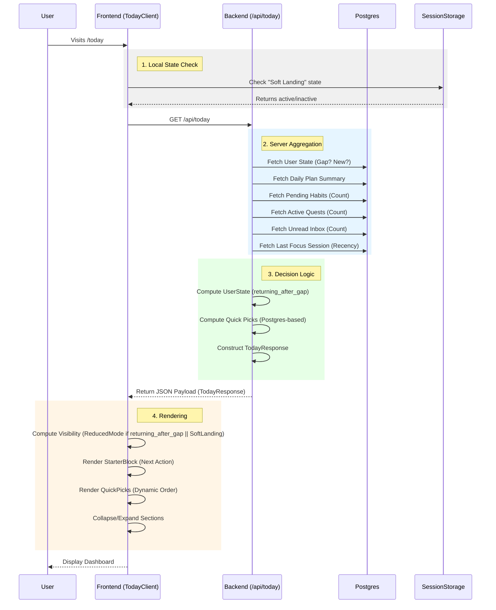

# Starter Engine Dataflow

This document illustrates how the Today page is populated, from user request to final render.

## End-to-End Flow

## Computation Logic

### 1. User State & Reduced Mode
The backend calculates `returning_after_gap` based on `last_activity_at > 3 days`.
- If `true`: Frontend defaults to **Reduced Mode** (Sections collapsed, focus on single action).
- If `false`: Standard view.

### 2. Dynamic UI (Quick Picks)
Currently implemented as a **Waterfall Priority** (Postgres-only):
1.  **Habits**: Added if pending > 0.
2.  **Quests**: Added if active > 0.
3.  **Inbox**: Added if unread > 0.
4.  **Resume Focus**: Added if last session exists (fetched via `LIMIT 1 ORDER BY ended_at DESC`).
Order is implicitly hardcoded in the list construction order.

### 3. Soft Landing (Client-Side)
When a user completes an action (Focus, Quest, etc.):
1.  Client stores `soft_landing=active` in `sessionStorage`.
2.  Redirects to `/today`.
3.  `TodayGridClient` reads storage and forces **Reduced Mode** regardless of Server State.
4.  User sees a "Soft Landing" or "Momentum" banner.
5.  Interaction with sections clears the state.
