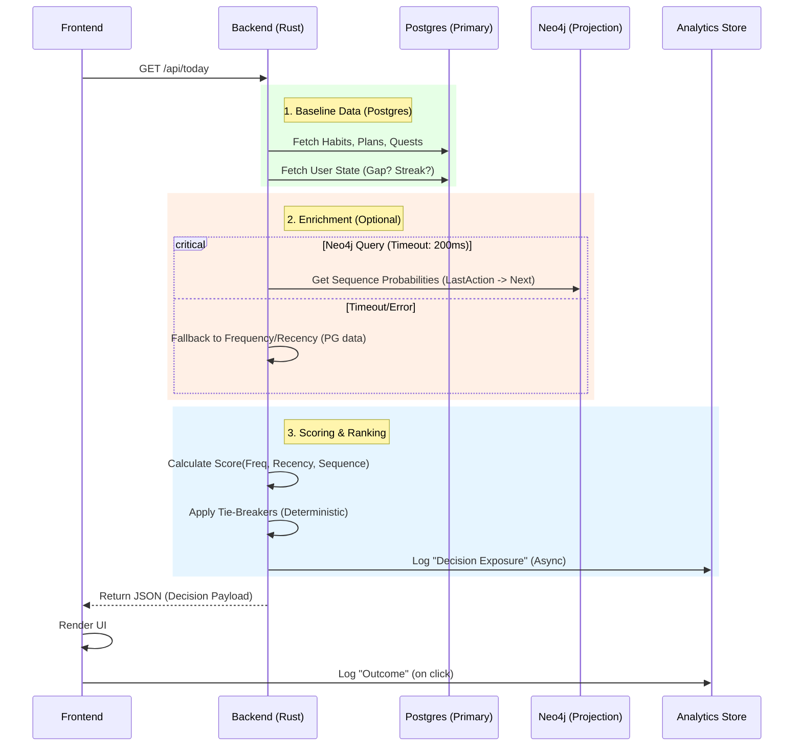

# Future State Specification: Starter Engine V2

**Status:** DRAFT
**Initiative:** Dynamic UI & Decision Intelligence
**Previous State:** [README.md](../README.md)

## 1. Scope & Boundaries

The goal of Starter Engine V2 is to introduce **decision intelligence** to the implementation without compromising user autonomy or system reliability.

### 1.1 In Scope
*   **Today Page "Quick Picks"**: The dynamic list of suggested actions (Habits, Quests, Inbox, etc.) will be reordered based on intelligent scoring.
*   **Decision Telemetry**: Full server-side logging of what was shown ("Exposure") and client-side logging of what was taken ("Outcome").
*   **Explainability**: Adding a neutral "Why this?" microline to Quick Pick items.

### 1.2 Out of Scope (Strict)
*   **Global Navigation**: The sidebar and main menu structure MUST remains static.
*   **Shortcut Bars**: Fixed user-defined shortcuts MUST NOT be reordered effectively.
*   **Content Hiding**: Recommendations MUST NOT hide distinct functionality that is otherwise available. The "Reduced Mode" collapse logic remains state-driven (User State), not score-driven.

---

## 2. Architecture & Fallback

The system introduces Neo4j as a **Read-Only Projection**. The critical path remains Postgres-dependent.

### 2.1 Dataflow Diagram



### 2.2 Fallback Strategy
*   **Primary Source**: Postgres is the System of Record. Usage counts and recency timestamps are fetched from Postgres.
*   **Secondary Source**: Neo4j provides `transition_probability` ($T_{a \to i}$).
*   **Failure Mode**: If Neo4j is unreachable, slow (>200ms), or stale (>6h), $T_{a \to i}$ is treated as `0.0`. The ranking degrades gracefully to a simple Frequency/Recency sort.

---

## 3. Telemetry & Event Taxonomy

### 3.1 Decision Exposure (Server-Side)
Triggered when the specific list of Quick Picks is finalized and sent to the client.

*   **Event Name**: `decision_exposed`
*   **Source**: Backend (`today.rs`)
*   **Payload**:
    ```json
    {
      "exposure_id": "uuid-v4",   // GENERATED PER REQUEST
      "user_id": "uuid",
      "timestamp": "ISO-8601",
      "context": {
        "reduced_mode": boolean,
        "last_action_type": "focus_session",
        "time_of_day": "morning"
      },
      "candidates": [
        {
          "id": "habit:123",
          "type": "habit",
          "position": 1,
          "score": 0.85,
          "score_components": { "freq": 0.5, "seq": 0.35 }
        },
        // ...
      ]
    }
    ```

### 3.2 Decision Outcome (Client-Side)
Triggered when a user interacts with a recommended item.

*   **Event Name**: `decision_outcome`
*   **Source**: Frontend (`TodayClient.tsx`)
*   **Payload**:
    ```json
    {
      "exposure_id": "uuid-v4",   // PASSED DOWN FROM SERVER REPONSE
      "decision_id": "habit:123", // ID of the clicked item
      "action": "started",        // started | completed | dismissed
      "time_to_action_ms": 4500
    }
    ```

### 3.3 Success Metrics (Attribution)
*   **Primary Conversion**: `started` event matching `exposure_id` within **5 minutes**.
*   **Secondary Engagement**: `completed` event within **60 minutes**.
*   **Bounce**: No interaction within **2 minutes**.

---

## 4. Deterministic Ranking Engine

The ranking algorithm is a linear combination of signals. It MUST be deterministic.

### 4.1 Scoring Formula
For each candidate item $i$:

$$Score_i = (W_F \cdot F_i) + (W_R \cdot R_i) + (W_S \cdot S_i) + (W_C \cdot C_i)$$

| Signal | Symbol | Source | Description |
| :--- | :--- | :--- | :--- |
| **Frequency** | $F_i$ | Postgres | Normalized count of total completions (0-1). |
| **Recency** | $R_i$ | Postgres | Time decay function: $1 / (1 + days\_since\_last)$. |
| **Sequence** | $S_i$ | Neo4j | Probability $P(Next=i \mid Prev=LastAction)$. |
| **Context** | $C_i$ | Postgres | Bonus for matching Goal/Time-of-Day (0 or 1). |

**Default Weights (Configurable):**
*   $W_F = 0.4$
*   $W_R = 0.3$
*   $W_S = 0.3$ (Fallback to 0 if Neo4j down)
*   $W_C = 0.0$ (Reserved for V2.1)

### 4.2 Tie-Breaking Rules (Mandatory)
If $Score_A == Score_B$ (to 4 decimal places):
1.  **Likelihood**: Higher Frequency raw count wins.
2.  **Type Priority**: Habit > Quest > Pick > Focus.
3.  **Stability**: Lower alphanumeric ID (UUID) wins.

---

## 5. Explainability Guidelines

The UI MAY show a "Why this?" microline.

### 5.1 Rules
1.  **Neutral Tone**: "Often done after X", not "You should do X".
2.  **Trust**: Do not cite signals that weren't used (e.g., don't say "For your goal" if Context score was 0).
3.  **Privacy**: Do not reveal specific titles of previous private items.

### 5.2 Examples
*   ✅ "Usually done in the morning"
*   ✅ "Frequently follows 'Morning Focus'"
*   ✅ "Based on your recent history"
*   ❌ "Don't break your streak!" (Manipulation)
*   ❌ "You're slacking on this" (Shame)

---

## 6. Implementation Targets

### 6.1 Backend (`app/backend/crates/api/`)
*   **`src/routes/today.rs`**:
    *   Inject `RankingService` into `fetch_dynamic_ui`.
    *   Construct `DecisionExposure` event and emit to async channel.
*   **`src/services/ranking.rs`** (NEW):
    *   Implement `Scorer` struct.
    *   Implement `PostgresSignalFetcher` and `Neo4jSignalFetcher`.
    *   Implement `calculate_score` with the fallback logic.

### 6.2 Frontend (`app/frontend/src/app/(app)/today/`)
*   **`TodayClient.tsx`**:
    *   Capture `exposure_id` from API response.
    *   Pass `exposure_id` to `QuickPicks` component.
*   **`QuickPicks.tsx`**:
    *   Render items in exact server order.
    *   Attach `onClick` handler to emit `decision_outcome`.

### 6.3 Database
*   **Postgres**: New table `decision_logs` (or similar) for storing exposure/outcomes if not using external analytics.
*   **Neo4j**: Schema for `(:User)-[:NEXT {count: N}]->(:Action)`.

---

## 7. Rollout & Safety

### 7.1 Feature Flags
*   `KillSwitch_Neo4j`: Force bypass of Neo4j query (100% fallback).
*   `KillSwitch_Ranking`: Force bypass of scoring (revert to old static list).

### 7.2 Safety Checks
*   **Staleness**: Middleware checks Neo4j `last_sync_at`. If > 6 hours, auto-enable `KillSwitch_Neo4j` for that request.
*   **Data Minimization**: Neo4j projection worker MUST explicitly strip PII before writing nodes.

---

## 8. Acceptance Tests

### 8.1 Unit Tests (Determinism)
```rust
#[test]
fn test_ranking_determinism() {
    let state = mock_state();
    let score1 = ranker.score(&state);
    let score2 = ranker.score(&state);
    assert_eq!(score1.items, score2.items); // Order must be identical
}

#[test]
fn test_tie_breaking() {
    let item_a = Item { score: 0.5, id: "b" };
    let item_b = Item { score: 0.5, id: "a" };
    // Rule: ID "a" comes before "b"
    assert_eq!(rank(vec![item_a, item_b])[0].id, "a");
}
```

### 8.2 Integration Tests (Telemetry)
*   **Scenario**: User loads Today -> Clicks Habit.
*   **Verify**:
    1.  Backend log contains `decision_exposed` with `exposure_id`.
    2.  Frontend API call contains `exposure_id`.
    3.  User outcome log contains matching `exposure_id` and `action="started"`.

### 8.3 Regression Tests
*   **Scenario**: Reduced Mode.
*   **Verify**: Even with high ranking scores, "Daily Plan" section remains collapsed if `returning_after_gap` is true. Recommendation engine DOES NOT override safety states.
